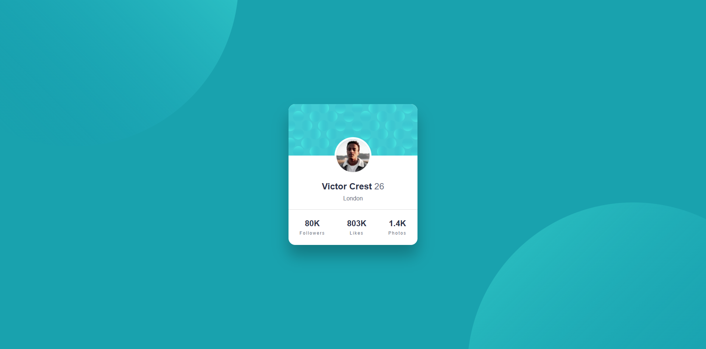
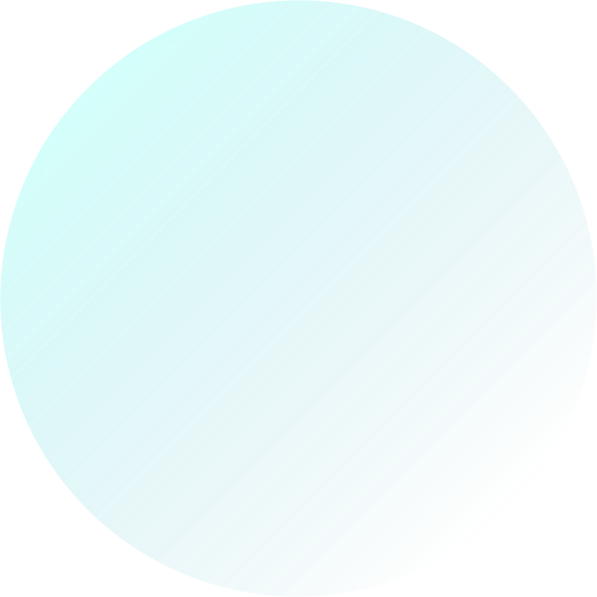

# Frontend Mentor - Profile card component solution

This is a solution to the [Profile card component challenge on Frontend Mentor](https://www.frontendmentor.io/challenges/profile-card-component-cfArpWshJ). Frontend Mentor challenges help you improve your coding skills by building realistic projects. 

## Table of contents

- [Overview](#overview)
  - [The challenge](#the-challenge)
  - [Screenshot](#screenshot)
  - [Links](#links)
- [My process](#my-process)
  - [Built with](#built-with)
  - [What I learned](#what-i-learned)
  - [Continued development](#continued-development)
  - [Useful resources](#useful-resources)
  - [AI Collaboration](#ai-collaboration)
- [Author](#author)
- [Acknowledgments](#acknowledgments)


## Overview

### The challenge

- Build out the project to the designs provided

### Screenshot


### Links

- My Solution URL: [solution](https://www.frontendmentor.io/solutions/profile-card-component-2o6pGQ2U3O)
- My Live Site URL: [live site](https://ncedononcedo27-cmyk.github.io/Profile-Card-Component/)

## My process

### Built with

- Semantic HTML5 markup
- CSS custom properties
- Flexbox
- CSS Grid
- Mobile-first workflow

### What I learned

* I learned how to structure a webpage using HTML by creating sections such as the profile card, profile image, and statistics.
* I learned how to use CSS to style a webpage, including changing colors, fonts, spacing, and adding rounded corners.
* I learned how to use Flexbox (display: flex) to center content and arrange items neatly.
* I learned how to position elements using position: absolute and position: relative, especially for the background patterns and profile picture.
* I learned how to use images as backgrounds with background-image and background-size: cover.
* I learned how to create a responsive webpage using the viewport meta tag and CSS measurements.
* I learned how to organize HTML and CSS into separate files, making the project easier to maintain.
* I gained a better understanding of how HTML provides the structure while CSS controls the appearance of a webpage.

Challenges I overcame:

* Positioning the profile picture correctly over the card header.
* Centering the profile card on the page.
* Styling the statistics section so all items were evenly spaced.
* Making sure the background images appeared in the correct positions.

To see how you can add code snippets, see below:

```html
<h1>Some HTML code I'm proud of</h1>
```





<div class="card">


<div class="card-header"></div>


<div class="info">


<h2>Victor Crest <span>26</span></h2>


<p>London</p>
```

```css
*{
margin:0;
padding:0;
box-sizing:border-box;
font-family:Arial,Helvetica,sans-serif;
}


body{


background:hsl(185,75%,39%);
height:100vh;


display:flex;
justify-content:center;
align-items:center;


overflow:hidden;
position:relative;


}
```

### Continued development 

Going forward, I would like to continue improving my HTML and CSS skills by creating more complex and responsive websites. I also want to learn CSS Grid, JavaScript, and web accessibility so I can build more interactive, user-friendly, and professional-looking websites. By practising more projects, I hope to become more confident and improve the quality of my code.


### Useful resources

- [Cisco HTML Essentials](https://www.netacad.com/courses/html-essentials) 
- [w3schools](https://www.w3schools.com/css/default.asp)


### AI Collaboration

Describe how you used AI tools (if any) during this project. This helps demonstrate your ability to work effectively with AI assistants.

- What tools did you use (e.g., ChatGPT, Claude, GitHub Copilot)?
* ChatGPT, Gemini and whatsapp meta.gvb     

- How did you use them (e.g., debugging, generating boilerplate, brainstorming solutions)?
* ChatGPT helped me with the html and css refinement. I really liked this pattern and will use it going forward. Gemini helped me understand my errors . I'd recommend it to anyone still learning this concept.

- What worked well? What didn't?
* ChatGPT and Gemini worked very well for me but whatsapp meta did not.


## Author

- Frontend Mentor - [@ncedononcedo27-cmyk](https://www.frontendmentor.io/profile/ncedononcedo27-cmyk)

## Acknowledgments
I would like to sincerely thank my classmate Lindsey for her guidance, support, and assistance throughout this project. Her explanations and feedback helped me better understand HTML and CSS concepts, especially with styling, positioning, and organizing my code. I truly appreciate the time and effort she invested in helping me complete this project successfully.


